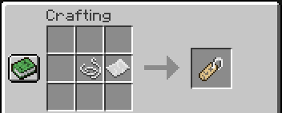
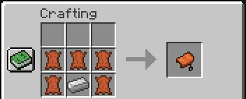
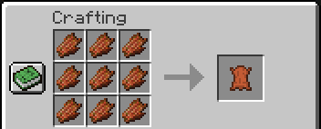

# Minecraft Tweaks

Some quality-of-life crafting recipes for Minecraft Bukkit servers.

### Installing
1. Download `Tweaks.jar` from the [latest release](https://github.com/cpuSonicatt/minecraft-tweaks/releases).
2. Place `Tweaks.jar` in your server's `/plugin` folder.
3. Reload your server, log in and enjoy.

### Crafting recipes

Here is each crafting recipe, along with my rationale. 

  
I felt like name tags were too rare for their use: naming things. I liked seeing what people named their pets or items and waiting for someone to find 2 or 3 name tags got quite tedious.

  
Equally, saddles are essentially used for horses (or pigs if that's your vibe), which bump up movement speed by a bit. Again, too rare for their use.

  
For people who don't want to adventure down into dungeons, cobwebs are very hard to come by. I decided to put honey instead of a slime ball because slimes are rare enough as it is, and there are more interesting things to use a slime ball with. 

  
Having a world late-game means you probably have a mob-spawner, or at least have a fair amount of mob junk. The most useless one, rotten flesh, was also the most abundant, so I felt like giving it another use. Leather made sense in this case (if you don't think about it for too long). 
