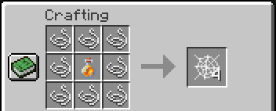

# Minecraft Tweaks

Some quality-of-life crafting recipes for Minecraft Bukkit servers.

### Installing
1. Download the JAR from the [latest release](https://github.com/cpuSonicatt/minecraft-tweaks/releases).
2. Place the JAR in your server's `/plugin` folder.
3. Reload your server, log in and enjoy.

### Included crafting recipes

  

  

  

  

### Extending
To add a new recipe, add a new object to the `recipes.json` array:
```json
{
    "key": "<item key>",
    "ingredients": [
      {"material": "<ingredient material>", "association": "<ingredient association>"}
    ],
    "produces": {
      "material": "<produce material>",
      "amount": "<produce amount>"
    },
    "instruction": ["<crafting instruction>"]
  }
```
- **Item key** - `string`, unique name for the produced material.
- **Ingredient material** - `string`, the string value of the org.bukkit.Material enum.
- **Ingredient association** - `string`, the association of the material (API takes a char, so the first character of the string will be used. Make sure they're unique).
- **Produce material** - `string`, the string value of the org.bukkit.Material enum.
- **Produce amount** - `int`, amount of produce material to return.
- **Crafting instruction** - `string[]`, a representation of the crafting table grid, using the ingredient associations.
